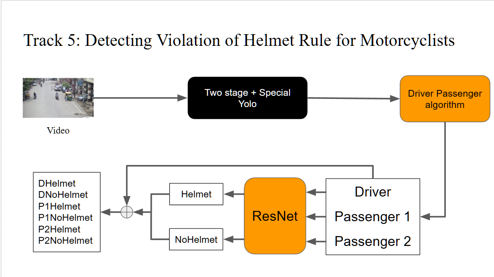
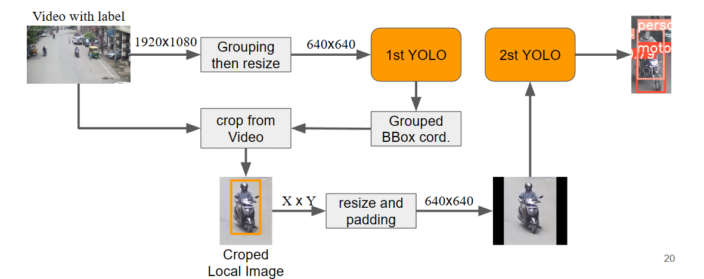
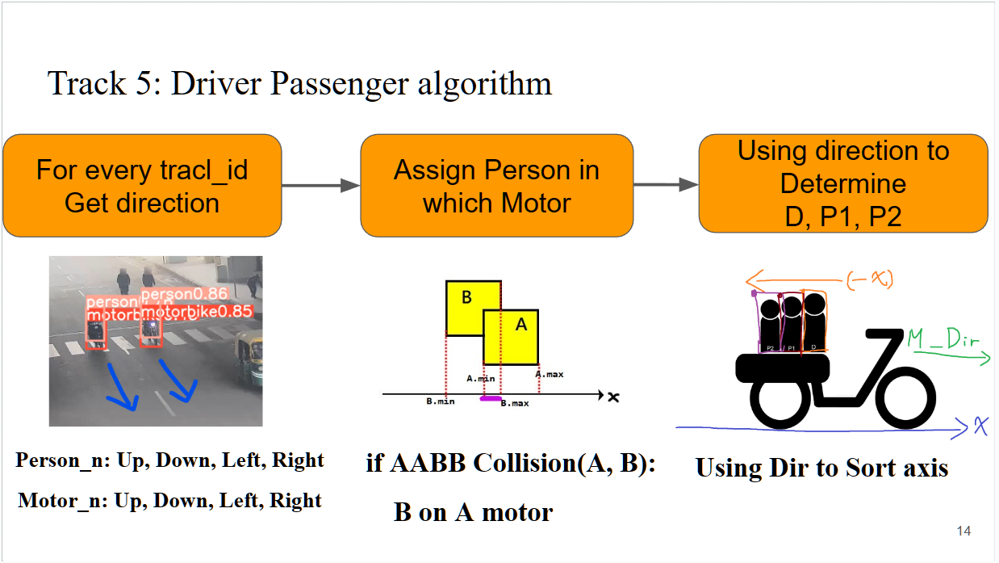
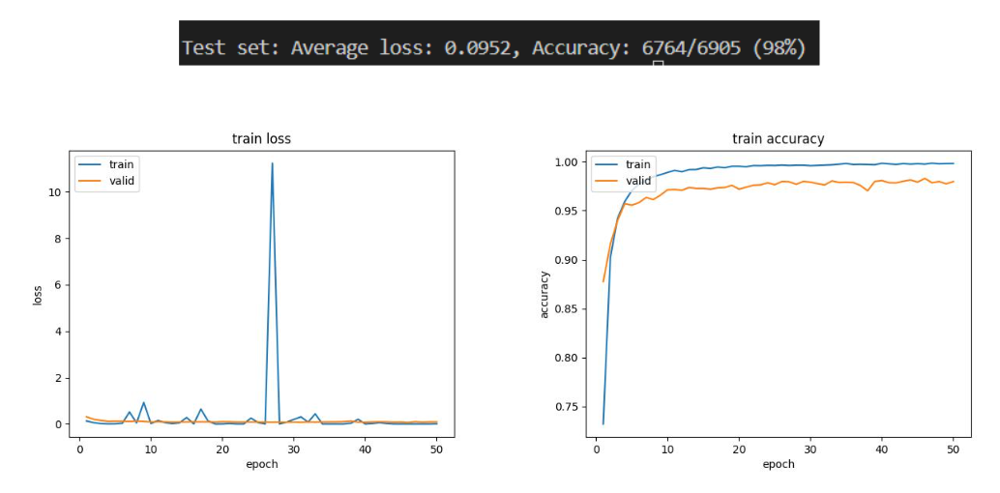

# AI City: Detecting Violation of Helmet Rule for Motorcyclists

[2023 AI CITY CHALLENGE](https://www.aicitychallenge.org/)

Challenge Track 5: Detecting Violation of Helmet Rule for Motorcyclists

Motorcycles are one of the most popular modes of transportation, particularly in developing countries such as India. Due to lesser protection compared to cars and other standard vehicles, motorcycle riders are exposed to a greater risk of crashes. Therefore, wearing helmets for motorcycle riders is mandatory as per traffic rules and automatic detection of motorcyclists without helmets is one of the critical tasks to enforce strict regulatory traffic safety measures. 

# Model Architecture


# Two_Stage YOLOv8


# Driver Passenger Algorithm


# File Tree

```
AI City: Detecting Violation of Helmet Rule for Motorcyclists
├── resnet_helmet
│   ├── load_data.py
│   ├── predict.py
│   ├── Resnet_NF.py
│   ├── Resnet.py
│   └── train.py
├── weights
│   ├── FHD_Fullset_special_stage_best.pt
│   ├── FHD_stage1_best.pt
│   ├── resnet152_DA.pt
│   ├── resnet101_DA.pt
│   └── stage2_best.pt
└── YOLO
    ├── Path_and_Label.yaml
    ├── Yolov8_fine_tune.py
    └── Yolov8_predict.py
├── TSYTR.sh
├── TYTR.sh
├── arg.py
├── Two+special_Yolov8_Tracking_resnet.py
├── Two_stage_Yolov8_Tracking_resnet.py
```


# Resnet's Loss & Accuracy


# ToDo

- [ ] Upload pretrain weights
- [ ] Write quick start guide
- [ ] Wrap the code into command-line parameters for direct execution in the command line.
