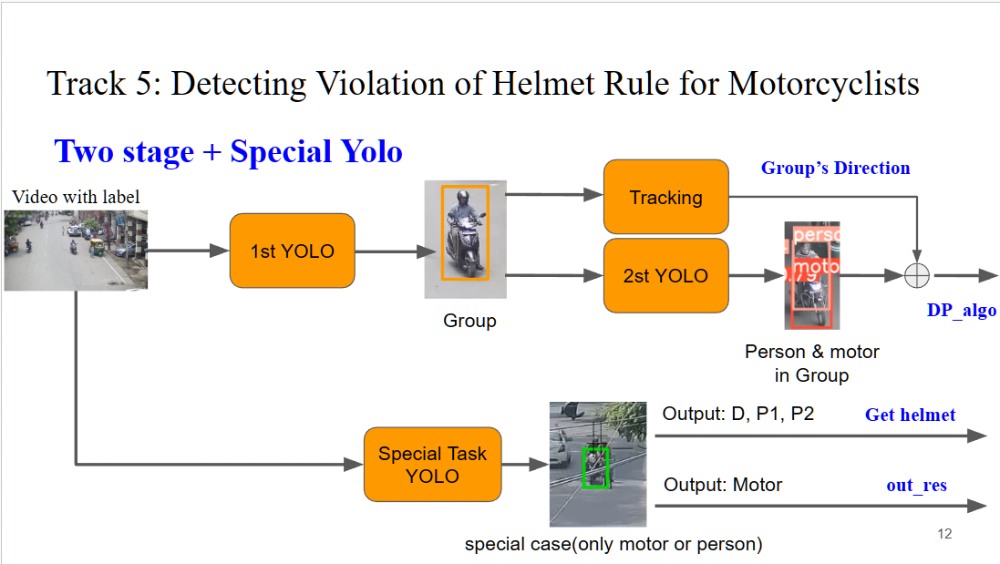

# AI City: Detecting Violation of Helmet Rule for Motorcyclists

[2023 AI CITY CHALLENGE](https://www.aicitychallenge.org/) - In Progress 

## Model Architecture

## Two_Stage YOLOv8


## File Introduction

```
├───models(.pt file)
│       resnet50.pt
│       yolov8l.pt
│       yolov8l_fine_tune.pt
│       Yolov8_person.pt
└───resnet_helmet(Training resnet for classfication)
│       load_data.py     # DataLoader
│       predict.py
│       Resnet.py        # Resnet50's Model Architecture
│       train.py
│
│   Path_and_Label.yaml  # determine Train(valid) sets, label
│   Pipeline.py          # Model Architecture Pipeline
│   Yolov8_fine_tune.py  # Fine-tune YOLOv8
│   Yolov8_predict.py    # Predict Using YOLOv8 
```


## Resnet's Loss & Accuracy

